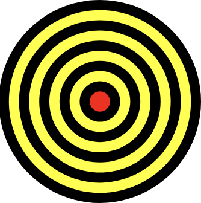
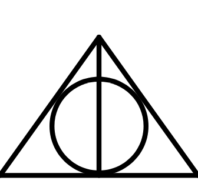

# Tillämpad Programmering 1 - Lektioner

## Lektion 1. Intro & BagaWork-grunder
* Kursintro
* Diskussion om vad vi ska tillämpa programmering på (BagaWork?)
* Bagawork
	* `Text.text().backgroundColor().left().right().top().bottom()`
	* `Button.text().page()`
	* `Space`
	* `Rows.children()`


## Lektion 2. BagaWork-layout
* Repetition
* GUI består av rader och kolumner
* `Columns`
* Övningar


## Lektion 3. En bok-app
Se klassuppgiften `Bok-app` på Google Classroom.


## Lektion 4. Variabler & Klicklyssnare
* Page-variabler
* Page-metoder
* `Button.onClick()`
* `App.createStartPage()`
* App-variabler
* App-metoder

::: exercise 4.1
Skapa en sida som kommer ihåg ett namn i en Page-variabel. Namnet ska till en början vara `Alice`. Sidan ska visa namnet i en `Text`-komponent. Sidan ska även innehålla tre knappar, och när användaren klickar på en knapp så ska namnet i Page-variabeln ändras till `Bob`, `Claire` och `David` för respektive knapp.
:::

::: exercise 4.2
Skapa en ny app som kommer ihåg en färg i en App-variabel. Lägg sedan till 3 olika sidor i appen med valfritt innehåll. Färgen i app-variabeln ska användas som bakgrundfärg på alla tre sidor.
:::

::: exercise 4.3
Lägg till en Settings-sida. På den sidan ska användaren få välja vilken bakgrundsfärg appen ska använda. Användaren ska kunna välja mellan färgerna `red`, `blue`, `green` och `yellow` genom att klicka på respektive färgs knapp. När användaren klickar på en av knapparna så ska du alltså ändra värde i App-variabeln som du skapade i Övning 4.2.
:::

::: exercise 4.4
Lägg till en till App-variabel som används som textfärgen i appen. På alla sidors rot-komponenter kan du lägga till ett anrop till följande konfigurationsmetod:

```js
.font(Font.color(`red`))
```

T.ex.:

```js
class MyPage extends Page{
	
	createGui(){
		return Rows.font(Font.color(`red`)).children(
			// ...
		)
	}
	
}
```

För att göra all text på den sidan röd. Ändra `` `red` `` till din App-variabel.
:::

::: exercise 4.5
Skapa en app som fungerar som ett äventyrsspel där varje Page är ett rum i en grotta spelaren kan vara i. Genom att trycka på knappar så ska spelaren kunna gå till andra rum i grottan. I några av rummen ska det finnas kistor som spelaren kan öppna genom att trycka på en knapp. Då ska spelaren plocka upp det som ligger i kistan och bära med sig det. Använd App-variabler (tomma strängar till en början) för att hålla koll på vad spelaren har plockat på sig. Använd t.ex.:

* En App-variabel för att hålla koll på ifall spelaren har plockat upp en krona.
* En App-variabel för att hålla koll på ifall spelaren har plockat upp en trollstav.
* Etc.

När spelaren har plockat upp alla saker så ska spelaren ta sig tillbaka till startrummet, så det rummet fungerar även som slutrum. Här ska du på skärmen visa alla de saker som spelaren har plockat upp, och (vi låtsas att) spelet slutar när spelaren kommer tilllbaka hit och har plockat upp alla saker.

Om ni vill få in lite grafiska bilder i spelet så kan ni använda Unicode-symboler i `Text`-komponenten, som t.ex. följande: 👑 💎 💍 🪙 🏆 💰 💴 💵 💶 💷 📿 🪄
:::


## Lektion 5. Catch-up
Vi fortsätter att arbeta med övningarna ifrån föregående lektion.


## Lektion 6. Nummer & Matematik
* Skapa nummer
* `+`, `-`, `*`, `/`
* Skapa strängar med nummer i (`` `... ${...} ...` ``)

::: exercise 6.1
Skapa en sida som innehåller en Page-variabel med värdet 0. Sidans grafiska gränssnitt ska innehålla en `Row`-komponent med en `Text`-komponent och en `Button`-komponent. `Text`-komponenten ska visa numret som finns i Page-variabeln. När knappen klickas ska en Page-metod anropas (som du behöver skapa). Den Page-metoden ska öka numret i Page-variabeln med 1.
:::

::: exercise 6.2
Ändra sidan som du skapade i föregående övning så att det även finns en "minska med 1"-knapp.
:::

::: exercise 6.3
Lägg till en till Page-variabel på sidan som även den innehåller numret 0. Lägg sedan till en `Text`-komponent som visar numret i denna Page-variabel. Lägg sedan till två nya knappar som man kan klicka på för att öka/minska denna Page-variabel med 1.

När du är klar så ska du alltså ha två olika nummer i appen som du kan öka/minska med 1 genom att klicka på knappar.
:::

::: exercise 6.4
Lägg till fyra nya `Text`-komponenter på sidan. Den första ska visa `nummer1 + nummer2 = summan`, fast det ska in de riktiga värdena från Page-variablerna istället. De andra `Text`-komponenterna ska vara motsvarande för differensen, produkten och kvoten.
:::

::: exercise 6.5
Skapa en sida som visar en multiplikationstabell. Sidan ska visa (med tvåans multiplikationstabell som exempel):

```
2 * 0 = 0
2 * 1 = 2
2 * 2 = 4
2 * 3 = 6
2 * 4 = 8
2 * 5 = 10
2 * 6 = 12
2 * 7 = 14
2 * 8 = 16
2 * 9 = 18
2 * 10 = 20
```

Men användaren ska även kunna ändra vilken multiplikationstabell som visas. Du kommer alltså behöva ha en Page-variabel för att hålla koll på numret för den multiplikationstabell som visas, och du behöver även lägga till knappar användaren kan klicka på för att ändra multiplikationstabell. 
:::

::: exercise 6.6
Den här övningen går ut på att skapa en sida som innehåller knappar för siffrorna 0-9. Om du kan, positionera gärna knapparna så att det grafiska gränssnittet ser ut så här:

```
[1] [2] [3]
[4] [5] [6]
[7] [8] [9]
    [0]
```

När man klickar på knapparna så ska den intryckta sekvensen visas i en `Text`-komponent ovanför knapparna. Har man t.ex. tryckt på `[3]`, `[5]` och `[2]` så ska det se ut så här:

```
        352
[1] [2] [3]
[4] [5] [6]
[7] [8] [9]
    [0]
```

Du kan använda en Page-variabel som startar på nummer 0 för att hålla koll på vilka knappar användaren har tryckt på. Varje gång användaren trycker på en knapp så multiplicerar du Page-variabeln med 10 och lägger sedan till numret på knappen som användaren klickade på. Exempel:

```
nummer = 0
Användaren klickar på 3: nummer = 0*10 + 3 = 3
Användaren klickar på 5: nummer = 3*10 + 5 = 35
Användaren klickar på 2: nummer = 35*10 + 2 = 352
```

:::


## Lektion 7. Catch-up
Vi fortsätter att arbeta med övningarna ifrån föregående lektion.


## Lektion 8. Inputfält
* `EnterText`
	* `.store(...)`, `.page(...)`, `.pageIfEqual(...)`
* `EnterNumber`
	* `.store(...)`, `.page(...)`, `.pageIfEqual(...)`, `.pageIfLower(...)`, `.pageIfBetween(...)`, `.pageIfHigher(...)`

:::: exercise 8.1
Skapa en sida där användaren får mata in sin ålder i en `EnterNumber`-komponent. Om åldern är:

* Mindre än 18 så ska användaren kommer till en sida där det står `Lek och skratta!`.
* Mellan 18 och 67 så ska användaren komma till en sida där det står `Jobba mer!`
* Över 67 så ska användaren komma till en sida där det står `Ta det lugnt!`

Alla dessa tre sidor ska även ha en knapp användaren kan klicka på för att komma tillbaka till den första sidan.

::: details Ledtråd
Använd konfigurationsmetoden `PageIfLower()` tre gånger.
:::
::::

:::: exercise 8.2
Skapa en sida där användaren kan mata in sitt namn i en `EnterText`-komponent. Det namnet ska sparas i en App-variabel. Användaren ska sedan kunna klicka på en knapp för att komma till en annan sida med texten `Hej på dig, <NAMNET>!`, där `<NAMNET>` ska vara det namn som användaren uppgav den hade (alltså värdet i App-variabeln).

På den andra sidan ska det även finnas en knapp användaren kan klicka på för att gå tillbaka till den första sidan.

::: details Ledtråd
Använd konfigurationsmetoden `store()` för att komma ihåg namnet användaren har matat in i en App-variabel.
:::
::::

:::: exercise 8.3
Skapa en sida där användaren kan mata in en hastighet (`m/s`) och en tidslängd (`s`). När användaren klickar på en knapp på sidan så ska sträckan man kommer med den inmatade hastigheten och tidslängden beräknas och visas på sidan.

::: details Ledtrådar
Använd två Page-variabler:

* En för att komma ihåg hastigheten.
* En för att komma ihåg tidslängden.

För att spara det som användaren matar in i `EnterText`-komponenterna i dessa Page-variabler behöver du använda konfigurationsmetoden `store()` på `EnterText`-komponenterna.

Sträckan beräknar du helt enkelt med formeln `hastighet * tidslängd`.
:::
::::

::: exercise 8.4
Skapa en sida där användaren kan mata in ett lösenord i en `EnterText`-komponent. Du får själv bestämma vad det rätta lösenordet ska vara. Om användaren matar in:

* Det rätta lösenordet och klickar på en knapp så ska användaren komma till en sida där det står `Rätt lösenord!`.
* Ett felaktigt lösenord och klickar på en knapp så ska användaren komma till sida där det står `Fel lösenord`. På denna sida ska det även finnas en knapp användaren kan klicka på för att komma tillbaka till den första sidan.
:::


## Lektion 9. Program
Den här lektionen försöker vi bygga lite mer meningsfulla appar med den funktionalitet vi har lärt oss hittills i kursen.

::: exercise 9.1
Skapa ett multiplikationsrogram, där användaren kan träna på en multiplikationstabell.

På första sidan ska användaren få välja vilken multiplikationstabell hen vill öva på. Sedan ska användaren komma till den andra sidan.

På den andra sidan ska användaren få skriva in svaret på frågan `Vad är VALD_MULTIPLIKATIONSTABELL * 1?`. `VALD_MULTIPLIKATIONSTABELL` ska så klart ersättas med den tabell som användaren valde på första sidan. När användaren har skrivit in svaret på detta så ska användaren komma till den tredje sidan.

På den tredje sidan ska användaren få skriva in svaret på frågan `Vad är VALD_MULTIPLIKATIONSTABELL * 2?`. Och så vidare.

När användaren kommer till den sista sidan (som är en "resultatsida") så ska det finnas en knapp som leder tillbaka till den första sidan, så användaren kan välja en multiplikationstabell på nytt och träna igen.
:::

::: exercise 9.2
Skapa ett glosprogram där användaren kan träna på att lära sig engelska ord. När appen startar ska användaren få välja vilken categori av glosor hen vill träna på, så som `Färger`, `Siffror`, etc. (du får själv bestämma vilka kategorier du vill använda).

Efter detta val så ska användaren komma til en sida där hen får skriva in svaret på en glosa (du bestämmer vilka glosor du vill ha). Använd en sida per glosa, och 3 glosor per kategori. Användaren ska kunna komma vidare till nästa sida endast när hen skriver in rätt svar på glosan.

Efter att användaren klarat av sista glosan så ska användaren kunna ta sig tillbaka till den första sidan igen.
:::


## Lektion 10. `.keepIf()`
* `.keepIf()`
* Boolska värden (`true`/`false`)
* Matematiska jämförelseoperatorer (`<`, `==`, `>`, `<=`, `>=`, `!=`)
* Logiska operationer (`&&` (och), `||` (eller))
* Strängjämförelser (`==`, `!=`)
* Övningar

Med konfigurationsmetoden `.keepIf()` så kan vi behålla GUI-komponenter endast när ett visst villkor stämmer. 

::: example
[Visa i editor.](https://bagawork.com/editor#eNq1U+1Kw0AQfJVzf9QWQkkjVQl+EEWkgiIqaLGFnsnGFtPLcXdBS5rH8Ul8MS9Njb3SWD/wR+CS3ZndmZukQDkHNwU/DhBc8CMqJTmfeJwTfFHIAkn0Oe2xnsofXyBVeK2oUJf0EeuNoqIEqkQwUhbyr1kByiCzIIyjAIUE9z6FUQBuywJGx/nEGQQsiMNQoroD1/44d/U561vANZ+BLMg6xYuxeDm/XD5/KbcfTzxd2ict29RzmoyWlVzFz7LpD0dRIJDVi1JP3Wja5hMi74R13pzT5XyNptKl+uCMPpIHHL69RpEcNKw1OGcljoyYwjXgvQrsGtjBH0ZuVOn8JviXC7d2Sa1GPnVv7/zeM5tMp2SBuv0NPQ0jyha8gOvYOqMTcLfsMp83OOaRTpKRUyOannzqhF6QRF/k84dpvObUR1NyocYTSCZxQmb/CVFDyrSNhwv2mMjjOErGbMWA5caeOkqUitl8zEW8QLmmt4vyi+bVZmdWYaWzZOWJvh+hr/D/jbwdUrUpcy8F0fzVFhpaW/ZCn1lpV1WcSozTrpi6ZFY/ewcDRBBU)

```js
class MyPage extends Page{
	
	myAge = 10
	
	createGui(){
		return Rows.children(
			Text.keepIf(p.myAge == 10).text(`Jag behålls.`),
			Text.keepIf(p.myAge == 20).text(`Jag behålls inte`),
			Text.keepIf(p.myAge < 20).text(`Jag behålls`),
			Text.keepIf(p.myAge > 20).text(`Jag behålls inte`),
			Text.keepIf(p.myAge != 10).text(`Jag behålls inte`),
			Text.keepIf(p.myAge != 20).text(`Jag behålls`),
			Text.keepIf(p.myAge > 18 && p.myAge < 67).text(`Jag behålls inte`),
			Text.keepIf(p.myAge < 0 || p.myAge < 150).text(`Jag behålls inte`),
		)
	}
	
}
```
:::

::: exercise 10.1
Skapa en sida som visar ett nummer som finns i en Page-variabel som börjar på 0. Lägg sedan till en knapp användaren kan klicka på för att öka numret med 1.

När numret är:

* 1 så ska texten `Vi har börjat!` visas under numret.
* 10 så ska texten `Det börjar bli högt!` visas under numret.
:::

::: exercise 10.2
Den här övningen handlar om att implementera login-logiken för en liten app med ett konto. Du får själv bestämma vad det rätta användarnamnet och lösenordet för kontot är.

Skapa en sida där användaren kan mata in ett användarnamn och lösenord. När användaren klickar på `Logga in`-knappen där så ska användaren komma till nästa sida. På den här nästa sidan ska du visa:

* Texten `Inloggad`, ifall det inmatade användarnamnet och lösenordet är korrekta.
* Texten `Fel användarnamn/lösenord` och en tillbaka-knapp, ifall det inmatade användarnamnet och lösenordet är fel.
:::

::: exercise 10.3
Skapa en sida med två `EnterNumber`-komponenter. Numren som användaren matar in i dessa ska sparas i två Page-variabler. Det ska även finnas fyra knappar på sidan, en för varje matematisk operation:

* \+
* \-
* \*
* /

Den knapp användaren klickar på ska bestämma ifall summan, differensen, produkten eller kvoten av de två inmatade numren ska visas på sidan. För detta kommer du behöva en tredje Page-variabel som håller koll på vilken matematisk operation användaren har valt.

Om kvoten är vald och nämnaren är 0 så ska ett felmeddelande visas.
:::


## Lektion 11. Kassaskåp
Den här lektionen fortsätter vi att använda `.keepIf()`.

::: exercise 11.1
Den här övningen går ut på att skapa en sida som fungerar som dörren på ett kassaskåp. Börja med att lägga till knappar för siffrorna 0-9. Om du kan, positionera gärna knapparna så att det grafiska gränssnittet ser ut så här:

```
[1] [2] [3]
[4] [5] [6]
[7] [8] [9]
    [0]
```

När användaren klickar på knapparna så ska den intryckta sekvensen visas i en `Text`-komponent ovanför knapparna. Har man t.ex. tryckt på `[3]`, `[5]` och `[2]` så ska det se ut så här:

```
    352

[1] [2] [3]
[4] [5] [6]
[7] [8] [9]
    [0]
```

Du kan använda en Page-variabel som startar på nummer 0 för att hålla koll på vilka knappar användaren har tryckt på. Varje gång användaren trycker på en knapp så multiplicerar du Page-variabeln med 10 och lägger sedan till numret på knappen som användaren klickade på. Exempel:

```
nummer = 0
Användaren klickar på 3: nummer = 0*10 + 3 = 3
Användaren klickar på 5: nummer = 3*10 + 5 = 35
Användaren klickar på 2: nummer = 35*10 + 2 = 352
```

Det ska även finnas en knapp användaren kan klicka på för att ta bort den inmatade kombinationen.

När användaren har matat in den rätta kombinationen till kassaskåpet (du får själv välja vad den rätta kombinationen är) så ska du visa en knapp användaren kan klicka på för att komma till nästa sida, och där ska användaren kunna läsa ett hemligt meddelande.

:::

::: exercise 11.2
Ändra den andra sidan så att det där även finns:

* En knapp användaren kan klicka på för att stänga kassaskåpet (ta sig tillbaka till den första sidan).
* En knapp användaren kan klicka på för att komma till en tredje sida där användaren kan byta kombinationslås på kassaskåpet. Efter det ska användaren komma tillbaka till den andra sidan. 
:::


## Lektion 12. Appar
::: info Provinformation
På onsdag nästa vecka kör vi ett litet prov i form av en app ni ska skapa. Ni har lektionen på er att skapa appen/göra så långt ni kommer, och sedan får ni lämna in ert arbete på en Google Classroom-inlämning. Ni får reda på hur appen ska fungera i början av den lektionen.
:::

::: exercise 12.1
Skapa en app som användaren kan använda som en enkel miniräknare. [Exempel](https://bagawork.com/run/#eNq1lWFr2zAQhv+KEIPZresmGYVhKCPrxuiHlXYtbGUpWJXPiYktCenEGoL/++S4ce0sbjzYPgSkk/Tc3Zu785oypWi0plwmQCPKc2YM+bqaKkXgCUEkhrj1eiZmWP24BoZwi0zjNZuD59cnqAGtFqQ5qKxl/aikZUBTmSegDY1+rmmW0GgcUMGKyuPmCQ2oTFMD+INGo+363q3Lh4Aqx+u8rGGX9aYTeOO/Cb7aNNGnmTZ4ZYtH0OScjCqTAS5F0rVpMDbH7e4l7S822034m/xlwkfGl3MtrUguZC61F/MVE7Ef8kWWJxqEVz+Z4a1iHILt7rNA0LXn0KDU4KmAxK0YHUJsFp4KW2Y/+BteO8E2sG3vI7p0bCHMn4nsXpzhR4soRYhOdy8+do6kuMgzvnSeuCyUdUVjCz8YCDjZB/iUpSm4KDgM5hzt41xrmViOgyGn+yA3VmIG4hVKn6h3DvpMPo8HXHqzVmFdkWXPdb/Vba5WG7mbYt0CXEl3Kokck24h7AO9yH6YdzKA9yz/YdjRANj2bzhMO+2nlW78PNFoMnKjZ0Wjd6Nm7NxBoXLX+Z3x05k4U7O8TKeJ89g/dl6fHgemRKsSphrISlqyGX8EF0yQ8fsP8b/u3isZD+6NezDx4Rbwdz4HtZSTHSk382s6h/8v5PcFw7em0lITx++XsJPreNS61z056zuZ9L6ZnA3oZifWQ/kbuCnP6Q==).
:::

::: exercise 12.2
(ett fiktionellt problem)

Jordbruksverket ska ut och inventera en skog. De ska helt enkelt gå runt i skogen och räkna hur många träd det finns av varje slag (gran, tall, björk, ek, och bok). För detta vill dem ha en app där de kan klicka på en knapp för respektive trädslag så snart de går förbi ett sådant träd för att räkna det. När de är klara med inventeringen så ska appen visa hur många av respektive trädslag som fanns, och hur stor andel av alla träd dem utgjorde.

Tänk igenom en design för detta (rita gärna upp den med papper och penna), och implementera sedan appen åt dem.
:::


## Lektion 13. App icons
I en BagaWork app kan du skapa en ikon för appen genom att lägga till metoden `App.createIcon()`, t.ex.:

```js
class MyApp extends App{
	
	createStartPage(){
		return StartPage
	}
	
	createIcon(){
		return PaperGroup.backgroundColor(`red`).children(
			PaperLine.start(2, 2).end(8, 8).thickness(0.5).backgroundColor(`black`),
			PaperLine.start(2, 8).end(8, 2).thickness(0.5).backgroundColor(`black`),
		)
	}
	
}
```

`App.createIcon()` måste returnera en `PaperGroup`-komponent, och i den kan du använda andra komponenter vars namn börjar på `Paper`, så som `PaperLine`, `PaperCircle` och `PaperRectangle`. Koordinatsystemet här är som standard 10*10, med origo nere i det vänstra hörnet.

Ikonen som skapas kan du förhandsgrandska i editorn genom att klicka på `Icon`-knappen.

::: exercise 13.1
Träna på att skapa några olika app-ikoner. Du får skapa vilka du vill, men om du föredrar att ha några att efterlikna så kommer här några exempel nedan.








:::