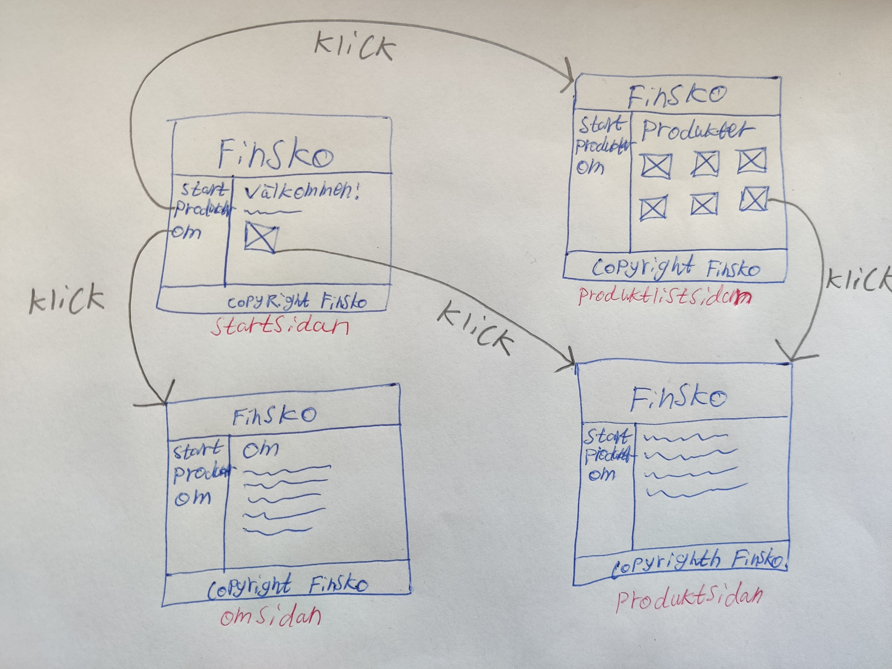

# Webbserverprogrammering 1 - Lektioner


## Snabblänkar
* [W3Schools HTML Tutorials](https://www.w3schools.com/html/)
* [W3Schools HTML Elements Reference](https://www.w3schools.com/tags/)
* [W3Schools CSS Tutorials](https://www.w3schools.com/css/)
* [W3Schools CSS Reference](https://www.w3schools.com/cssref/index.php)


## Lektion 1. HTML-repetition
* Introduktion till vad ni kommer lära er i kursen
* HTML taggtest
* HTML-repetition
* HTML-övning

::: exercise 1.1
Skapa en ny `.html`-fil i Visual Studio Code och skriv HTML-kod i den som visar en sida som ser ut som följande:

```html result no-code
<h1>Harry Potter-världen</h1>
<p>Harry Potter är en välkänd bokserie skriven av J. K. Rowling. Här kommer vi ta en liten snabbtitt på vad den innehåller.</p>

<h2>Böcker</h2>
<ol>
	<li>Harry Potter och de vises sten</li>
	<li>Harry Potter och hemligheternas kammare</li>
	<li>Harry Potter och fången från Azkaban</li>
	<li>Harry Potter och den flammande bägaren</li>
	<li>Harry Potter och Fenixorden</li>
	<li>Harry Potter och halvblodsprinsen</li>
	<li>Harry Potter och dödsrelikerna</li>
</ol>

<h2>Huvudpersoner</h2>
<ul>
	<li>Harry Potter</li>
	<li>Ron Weasley</li>
	<li>Hermione <del>Ganger</del> Granger</li>
	<li>Lord Voldemort</li>
	<li>Albus Dumbledore</li>
</ul>

<h2>Ordförklaringar</h2>
<dl>
	
	<dt>Mugglare</dt>
	<dd>En person utan magiska krafter.</dd>
	
	<dt>Dödsätare</dt>
	<dd>En anhängare till Lord Voldemort.</dd>
	
</dl>
```
:::


## Lektion 2. JS-grunder
* Samma JS-grunder som i [Webbuteckling 2](../../webbutveckling-2/lektioner/).


## Lektion 3. Webbapp (Node.js)
* [Node.js](https://nodejs.org/en/download)
* npm
* HTTP
* `node:http`-modulen

::: exercise 3.1

Skapa ett nytt **private** repository på GitHub, ge `PeppeL-G` tillgång till det, klona det till din egen dator, och spara sedan allt ditt framtida arbete i den här kursen där. Skapa en ny commit och pusha den till GitHub vid slutet av varje lektion.

:::

::: exercise 3.2

Skapa ett nytt projekt för att testa köra en Node.js app:

1. Skapa en ny mapp med namnet `hello-world`.
2. Öppna mappen i Visual Studio Code.
3. I mappen, skapa:
	* `package.json` innehållande `{"type": "module"}`
	* `main.js` innehållande:
	```js
	console.log(`Hello, world!`)
	```
4. Starta appen med Node.js ifrån Visual Studio Code-fönstret (fråga eventuellt om detta steg).

Ändra sedan koden i `main.js`-filen så att den skriver ut följande när man kör programmet (använd en loop):

```
Hello, world 1!
Hello, world 2!
Hello, world 3!
Hello, world 4!
```

Den som vill ha en mer avancerad uppgift att lösa kan lösa följande uppgift (du kan behöva ta reda på några funktionaliteter i JS du behöver använda själv):

```js
const blogposts = [{
	id: 1,
	title: `Trip to France`,
	content: `France is an amazing country, I loved being there.`,
}, {
	id: 2,
	title: `Exploring Norway`,
	content: `Norway is a very facinating country.`,
}, {
	id: 3,
	title: `Home, Sweet Home`,
	content: `Today I explored my own city, Jönköping, a little bit.`,
}]

// Skapa en funktion som utifrån arrayen ovan returnerar
// ett blogg-objekt med ett specifikt id.
const norwayBlogpost = getBlogpostById(blogposts, 2)

// Skapa en funktion som utifrån arrayen ovan returnerar en ny
// array med alla blogg-inlägg som innehåller ett viss sökord.
const norwayBlogpost = getBlogpostsContaining(blogposts, `is`) // Första och andra blogginlägget
```

:::

::: exercise 3.3

Skapa ett nytt projekt för att implementera en Node.js webbapp:

1. Skapa en ny mapp.
2. Öppna mappen i Visual Studio Code.
3. I mappen, skapa:
	* `package.json` innehållande `{"type": "module"}`
	* `main.js` innehållande:
	```js
	import http from 'node:http'
	
	const webApp = http.createServer(function(request, response){
		
		response.statusCode = 200
		
		response.setHeader(`Content-Type`, `text/plain`)
		
		response.write(`Hello!`)
		
		response.end()
		
	})
	
	webApp.listen(3000)
	```
4. Starta appen med Node.js ifrån Visual Studio Code-fönstret
5. Öppna localhost:3000 i en webbläsare.

Testa att skicka några request till din webbapp och verifiera att den skickar tillbaka ett response. Om du gör ändringar i koden så behöver du stoppa och sedan starta din Node.js-app igen för att ändringarna ska gälla.

:::

::: exercise 3.4

Ändra koden så att du skickar tillbaka en HTML-sida som webbläsaren visar som en HTML-sida, och inte som text. Du ska alltså skicka tillbaka HTML-kod och se till att `Content-Type`-headern har rätt värde i responsen.

:::


## Lektion 4. Webbapp (Node.js)
Vi fortsätter med grunderna i hur en webbapplikation fungerar. Se till att du är klar med övningarna från Lektion 3 innan du börjar med dessa övningar.

::: exercise 4.1

Läs ut lite information från den inkommande requesten, så som `request.method` och `request.url`. Lägg sedan till några villkorssatser som skickar tillbaka HTML-kod för några olika sidor som du själv väljer att ha. Du kan t.ex. ha:

* En sida för GET request till `/` (startsidan)
* En sida för GET request till `/about`
* En sida för GET request till `/contact`
* Etc.

I HTML-koden du skickar tillbaka, se till att även inludera länkar (`<a>`-element) till de andra sidorna. På detta vis borde användaren kunna klicka på länkarna för att ladda in de andra sidorna istället för att manuellt ändra URL:en i adressfältet i webbläsaren.

:::

::: exercise 4.2

Om du tar emot en request för en sida som inte finns, skicka tillbaka statuskoden `404` tillsammans med HTML-kod som förklarar att den efterfrågade resursen inte finns.

:::

::: exercise 4.3

Istället för att skriva HTML-koden direkt i strängar i JS-filen, skriv HTML-koden i separata `.html`-filer (i samma mapp), och använd funktionen `readFileSync()` från `node:fs`-modulen för att läsa in HTML-koden som en sträng, och skicka den sedan till `response.write()`.

```js
import fs from 'node:fs'

const htmlCodeForAboutPage = fs.readFileSync(`./about.html`, `utf8`)
```

:::

::: exercise 4.4

Använd `try{ ... }catch(error){ ... }` för att hantera fel (exceptions) som kan uppstå när du anropar `readFileSync()`. Om HTML-filen som ska öppnas t.ex. inte finns (om du t.ex. råkat ta bort den av misstag) så kommer `readFileSync()` kasta ett exception. Fånga det med `try{ ... }catch(error){ ... }`, och skicka vid sådana fel tillbaka statuskoden `500` med HTML-kod för att förklara för användaren att ett oväntat fel inträffade, och att requesten inte kunde utföras.

:::

::: exercise 4.5

Skapa en `.css`-fil med lite CSS-kod som stylar dina sidor. Lägg sedan till `<link>`-elementet i din HTML-kod för att få webbläsaren att skicka en GET request för att hämta innehållet i CSS-filen. Ändra din JS-kod så att du skickar tillbaka innehållet i CSS-filen när du tar emot en sådan request. Se även till att du sätter `Content-Type`-headern till värdet `text/css`, så webbläsaren kan vara säker på att den får tillbaka CSS-kod.

:::


## Lektion 5. Catch-up
Vi fortsätter att arbeta med övningarna ifrån Lektion 3 och Lektion 4.

::: exercise 5.1
En student som är klar med övningarna ifrån Lektion 3 och Lektion 4 presenterar sin lösning för öriga klassen och förklarar hur det fungerar.
:::

::: exercise 5.2
De elever som är klara med Lektioner 3 och Lektion 4 kan få försöka börja arbeta med Express-ramverket på egen hand. Vi kommer gå igenom det tillsammans nästa lektion.

Tutorialn [Node.js Express.js](https://www.w3schools.com/nodejs/nodejs_express.asp) kan vara en bra startpunkt. Försök i första hand att läsa och förstå, så skriver vi kod nästa lektion. Men om du vill så får du förståss gärna försöka skriva kod själv redan nu.
:::


## Lektion 6. Webbapp (Express)
Att implementera en webapp direkt i Node.js fungerar, men genom att använda ett ramverk som Express så får vi bättre stöd för att:

* Dynamiskt generera HTML-kod vi skickar tillbaka (rendering engine).
* Återanvända funktionalitet i olika HTTP-requests (middlewares).
* Enkelt lägga till funktionalitet som de flesta webbappar använder (skicka tillbaka statiska filer, hantera sessioner, använda cookies, etc.).

Så låt oss skapa en ny hemsida som använder sig av Express:

1. Skapa en ny mapp för din hemsida, t.ex. `min-hemsida`.
2. Öppna den mappen i terminalen/Windows Powershell och kör kommandot `npm install express` (`npm`-kommandot fick du på datorn när du installerade Node.js).
3. I den skapade `package.json`-filen, lägg till `"type": "module",` efter den första måsvingen (på egen rad). Detta gör så att vi kan använda den officiella `import`-syntaxen istället för `require()` för att importa funktionalitet från andra JS-filer.
4. Skapa `min-hemsida/app.js` med följande innehåll:
	```js
	import express from 'express'
	
	const app = express()
	
	app.get(`/`, function(request, response){
		response.send(`Hello, World!`)
	})
	
	app.get(`/about`, function(request, response){
		response.send(`About page!`)
	})
	
	app.listen(3000)
	```
5. Kör `min-hemsida/app.js` i Node.js med följande kommando i terminal/Windows Powershell så kommer Node.js automatiskt köra om filen så snart den ändras:
	* `node --watch app.js`
	* (för att senare stoppa Node.js från att köra så kan du hålla inne `[CTRL]` och trycka på `[C]` på tangentbordet)

::: exercise 6.1
Efter att du startat din webbapp enligt stegen ovan, öppna `http://localhost:3000` i en webbläsaren och verifiera att:

* En GET request för `/` skickar tillbaka texten `Hello, World!`.
* En GET request för `/about` skickar tillbaka texten `About page!`.

:::

Låt oss lägga till en renderingsmotor, så vi enklare kan generera och skicka tillbaka dynamisk HTML-kod.

1. Öppna `min-hemsida` i terminalen/Windows Powershell och kör kommandot `npm install express-handlebars`.
2. Ändra `min-hemsida/app.js`:
	```js
	// I toppen, lägg till:
	import { engine } from 'express-handlebars'
	
	// ...
	
	// Efter att du skapat app-variabeln, lägg till:
	app.engine(`hbs`, engine({
		defaultLayout: null,
	}))
	
	// Och använd sedan response.render()
	// istället för response.send():
	app.get(`/`, function(request, response){
		
		// Filen min-hemsida/views/start.hbs är en
		// fil du kommer skapa snart.
		response.render(`start.hbs`)
		
	})
	```
3. Skapa filen `min-hemsida/views/start.hbs`, och skriv lite HTML-kod i den:
	```hbs
	<h1>Startsidan!</h1>
	<p>Det här är startsidan...</p>
	```
4. Gör mostsvarande för about-sidan.

::: exercise 6.2

Verifiera att du har två olika sidor som fungerar:

* En GET request för `/` ska skicka tillbaka HTML-koden i `start.hbs`-filen.
* En GET request för `/about` ska skicka tillbaka HTML-koden i `about.hbs`-filen.

:::

Låt oss lägga till en layout som renderingsmotorn använder, så vi bara behöver skriva layout-koden på ett ställe, istället för i varje `.hbs`-fil.

1. Ändra `min-hemsida/app.js`:
	```js
	// ...
	
	app.engine(`hbs`, engine({
		defaultLayout: `main.hbs`, // Ändra här från null till `main.hbs`
	}))
	
	// ...
	```
2. Skapa filen `min-hemsida/views/layouts/main.hbs`:
	```js
	<!DOCTYPE html>
	<html lang="en">
	<head>
		<meta charset="UTF-8">
		<meta name="viewport" content="width=device-width, initial-scale=1.0">
		<title>Min hemsida</title>
	</head>
	<body>
		
		<nav>
			<a href="/">Start</a>
			<a href="/about">Om</a>
		</nav>
		
		<main>
			{{{body}}}
		</main>
		
	</body>
	</html>
	```

::: exercise 6.3
Låt oss nu träna på att lägga till fler sidor.

Lägg till en "Kontakta oss"-sida. Du kommer behöva:

1. Bestämma vilken URL sidan ska ha.
2. Skapa en ny `.hbs`-fil i `views`-mappen som innehåller sidans innehåll.
3. I `app.js`-filen lägga till ett `app.get()`-anrop för att rendera sidan när en request med den bestämda URL:en tas emot.
4. I `views/layouts/main.hbs`-filen lägga till en länk till den nya sidan.

Gör sedan det samma för en till sida, t.ex. en FAQ-sida.
:::

::: exercise 6.4
Gör generella förbättringar på sidan:

* Använd bättre HTML-kod.
* Lägg till fler sidor.
* Lägg till CSS-kod som stylar och gör sidan snyggare (för stunden kan du skriva CSS-koden i `<style>`-elementet i layout-filen, men optimalt så ska ju den skrivas i en separat CSS-fil (vi kommer titta närmare på det senare).).
* Etc.
:::


## Lektion 7. Webbapp (Express)
Ni som inte är klara med övningarna ifrån föregående lektion gör bäst i att först gör klart dem.

---

En webbapplikation behöver ofta skicka tillbaka statiska filer, så som bildfiler, client-side JS-filer, CSS-filer, etc. Express har en enkel *middleware* man kan lägga till för att skicka tillbaka alla sådana filer som ligger i en mapp: [express.static()](https://expressjs.com/en/starter/static-files.html).

::: exercise 7.1
Skapa en ny mapp i din hemside-mapp och lägg några statiska filer i den, så som bilder och CSS-filer. Försöka sedan att ladda in bilderna och CSS-filerna på din hemsida så användaren kan se bilderna på en sida, och HTML-koden stylas enligt den CSS-kod du skrivit i CSS-filerna.
:::

---

Styrkan med Handlebars är att den enkelt kan sätta in data i HTML-koden. Så låt oss gå igenom ett exempel på det genom att skapa en ny sida med information om dig, med den faktiska informationen i `.js`-filen och som vi sedan skickar till `.hbs`-filen:

1. Bestäm vilken URL som ska användas för sidan med information om dig.
2. Lägg till en request handler (`app.get()`) i `app.js`-filen för den URL:en. I din request handler-funktion så kan du skapa ett `model`-objekt som innehåller informationen om dig, och som du sedan skickar till `.hbs`-filen:
	```js
	// ...
	
	app.get(`/info-about-me`, function(request, response){
		
		const model = {
			name: `Alice`,
			age: 25,
		}
		
		response.render(`info-about-me.hbs`, model)
		
	})
	
	// ...
	```
3. Skapa sedan `views/info-about-me.hbs`-filen och visa informationen du tar emot ifrån `model`-objektet:
	```handlebars
	<h1>{{name}}</h1>
	<p>{{name}} är {{age}} år gammal.</p>
	```
	4. Testa sidan i en webbläsare och verifiera att det fungerar.

::: exercise 7.2
Låt oss träna lite mer på att använda `model`-objektet och <code>&#123;&#123;...&#125;&#125;</code>-syntaxen i Handlebars.

Skapa en ny sida som visar summan av två slumpade heltal, t.ex. `5 + 8 = 13`. Varje gång man går in på sidan så ska alltså två nya tal slumpas fram, och dem och deras summa ska visas för användaren.

För att slumpa fram ett heltal mellan 0 och 99 kan du använda `Math.floor(Math.random()*100)`.
:::

::: exercise 7.3
Det här är samma övning som den föregående, men nu ska du skapa en ny sida där tre olika slumptal visas ihop med deras produkt (multiplicera ihop dem).
:::

---

En webbapp innehåller vanligtvis data av något slag. Finns det t.ex. en blog på en hemsida så finns informationen om bloggposterna nedsparad någonstans. I en Express-app så kan man i det enklaste fallet lägga sådan information i en array i JavaScript-koden (med ett objekt för varje blogpost):

```js
const blogposts = [
	{id: 1, title: `Min första blogpost`, content: `Innehållet i ettan...`},
	{id: 2, title: `Min andra blogpost`, content: `Innehållet i två...`},
	{id: 3, title: `Min tredje blogpost`, content: `Innehållet i trean...`},
	// ...
]
```

Ofta vill man att varje blogpost ska ha ett unikt värde man kan använda för att identifiera just den blogposten. Det är bra att ha om man t.ex. vill visa en specifik blogpost, eller ta bort ett specifikt blogpost, etc. Ofta använder man att ett fält som heter `id` för just det.

I Handlebars så kan man sedan använda <code>&#123;&#123;#each&#125;&#125;</code> för att skapa HTML-kod för varje värde i en array.

::: example
Om ditt `model`-objekt innehåller följande:

```js
const model = {
	blogposts: [
		{id: 1, title: `Första`},
		{id: 2, title: `Andra`},
	]
}
```

Och din Handlebars-kod är följande:

```handlebars
{{#each blogposts as |post|}}
	<p>Blogposten med id {{post.id}} har titeln {{post.title}}.</p>
{{/each}}
```

Så skulle följande HTML-kod genereras:

```html
<p>Blogposten med id 1 har titeln Första.</p>
<p>Blogposten med id 2 har titeln Andra.</p>
```
:::

::: exercise 7.4
I din webbapp, lägg till en array med några objekt av något slag. De kan t.ex. representera blogposter, eller nyhetsartiklar, eller produkter, etc. Skapa sedan en sida som visar namnet/titeln på dem i en HTML-lista.
:::

---

En sida som listar alla data-objekt på det viset visar vanligtvis väldigt lite information om data-objektet. Kanske endast dess titel, och eventuellt en tillhörande bild. Men vanligtvis kan man klicka på dessa för att se mer information om data-objektet. Då kommer man till en sida som visar all information om det data-objektet. URL:erna för dessa sidor är ofta (med bloggposter som expempel):

* `/blogposts` visar alla blogposts med lite info, vardera med en länk till en av nedanstående sidor:
* `/blogposts/1` visar all info om blogposten med id `1`
* `/blogposts/2` visar all info om blogposten med id `2`
* Etc.

I Express så vill vi inte hårdkoda in alla olika `` app.get(`/blogposts/1`, ...) ``, för det skulle göra vår kod väldigt stor. Men Express har stöd för placeholders som vi kan använda i URL:en i vår request handler:

```js
// Den här request handlern kommer köras för:
// /blogposts/1
// /blogposts/2
// Etc.
// Delen som börjar på : indikerar en placeholder.
app.get(`/blogposts/:id`, function(request, response){
	
	// Här kan vi läsa ut vilket nummer
	// som faktiskt används i URL:en.
	const id = request.params.id
	
})
```

Genom att läsa ut `id`, så kan vi sedan hämta blogpost-objektet med just det id:et:

```js
const blogpostWithId4 = blogposts.find(b => b.id == 4)

const id = 5
const blogpostWithId5 = blogposts.find(b => b.id == id)
```

Sedan kan vi lägga in det här blogpost-objektet i en model och skicka den till en Handlebars-fil som visar all info om det blogpost-objektet.

::: tip Tips
Placeholdern i Express-URL:er behöver inte heta `id`, utan du kan kalla den något annat om du vill.
:::

::: exercise 7.5
På din sida som visar alla dina data-objekt, lägg till länkar som leder till en ny sida som visar all information om det data-objekt/länk som man klickade på.
:::

::: exercise 7.6
På sidan som listar alla dina data-objekt, använd gärna en flexbox-container och visa varje data-objekt som ett stort klickbart element.
:::


## Lektion 8. Catch-up
Vi fortsätter arbeta med övningarna från föregående lektioner. 


## Lektion 9. Catch-up
Vi fortsätter arbeta med övningarna från föregående lektioner.

De som är klara med övningarna kan börja titta på hur man kan skapa och använda en databas av något slag för att spara ner data-objekten i en sådan istället för i en JavaScript array. På detta vis kan vår webbapplikation hantera fler data-objekt, ändringar som vi gör på data-objekten kommer överleva server-omstarter, etc.

I enklaste fall så kan man använda en JSON-fil innehållandes arrayen med data-objekten, som man sedan laddar in varje gång man tar emot en request. Denna lösning är enkel, men inte särkillt bra för arrayer med många data-objekt (mycket data som laddas in i minnet samtidigt).

För arrayer med många data-objekt så är det bättre att använda en riktig databas av något slag. Den enklaste lösningen som är bra är att använda en SQLite 3-implementation (t.ex. [better-sqlite3](https://github.com/WiseLibs/better-sqlite3?tab=readme-ov-file), [tutorial](https://www.w3resource.com/sqlite/snippets/better-sqlite3-library.php#google_vignette)). Men du får gärna använda vad du än föredrar/är nyfiken på att lära dig.


## Lektion 10. Miniprojekt Finsko
Den här lektionen + 3 lektioner till framöver kommer vi individuellt arbeta med ett miniprojekt som ni kommer lämna in för bedömning. Projekt går ut på att från scratch skapa en ny hemsida i Express. Hemsidan är till för ett påhittat företag som heter *Finsko*. De tillverkar skor, och de vill kunna visa information om sitt företag och sina skomodeller på hemsidan.

Följande information ska finnas om varje skomodell (du får själv hitta på information om dem):

* Namn
* Pris
* Målgrupp (`Herrar`, `Damer` eller `Unisex`)
* Typ (`Löparsko`, `Gångsko`, etc.)
* Kort beskrivning av skomodellen
* Lång beskrivning av skomodellen
* Utgivningsdatum (t.ex. `2023-04-21`)
* En bild (sparas i static/public-mappen, det är OK att använda samma bild för alla skomodeller)

Hemsidan behöver åtminstone innehålla följande sidor:

* En startsida med:
	* En kort text som lite förklarar vad företaget gör
	* Information om en utvald skomodell (du får själv välja vilken)
* En omsida med mer utförlig information om vad företaget gör
* En produktlistsida som visar alla skomodeller företaget har, dock bara väldigt lite information om varje skomodell
* En produktsida som visar all information om den skomodell som användaren har klickat på

Bilden nedan visar exempel på hur det grafiskt kan se ut. Du får designa det grafiska gränssnittet hur du vill, men använd en riktig layout av något slag.



Varje `⊠` visar lite information om en skomodell med tillhörande bild, och att klicka på denna tar användaren till sidan med all information om skomodellen.

Det är OK att använda en [Lorem Ipsum-generator](https://sv.lipsum.com/) för texten på sidan.

De instruktioner som finns nedskrivet på Express-lektionerna borde räcka för att ni ska kunna implementera den här hemsidan. Ni får jobba på projektet även utanför lektionstid, och ni får be om hjälp av läraren på lektionstid. Dock kanske läraren är lite restriktiv med vad för hjälp han ger.


::: tip Klar?
Om du blir klar tidigt och vill ha en lite svårare utmaning så kan du försöka lägga till följande funktionalitet:

* Sortering på produktlistsidan.
* Paginering på produktliststidan (t.ex. visa 3 skomodeller per sida).
:::


## Lektion 11. Miniprojekt
Vi fortsätter att arbeta på miniprojektet (lektion 2 av 4).


## Lektion 12. Miniprojekt
Vi fortsätter att arbeta på miniprojektet (lektion 3 av 4).


## Lektion 13. Miniprojekt
Vi fortsätter att arbeta på miniprojektet (lektion 4 av 4).

<!--

## Lektion X. Databas
En webbapplikation kan spara data-objekt (så som information om blogposter) i en JS-array fungerar, men det finns några nackdelar med detta:

* Om det finns väldigt många data-objekt så kommer webbapplikationen att uppta mycket minne hela tiden.
* Om man stänger av webbapplikationen så kommer alla ändrar vi gör på data-objekten (så som att uppdatera dem, eller lägga till nya) att försvinna, så inga ändringar blir permanenta.

Därför är det bättre att spara ner informationen om våra data-objekt i en databas och som sparar datan på hårddisken (i en fil). Och i den här kursen kommer vi använda oss av den enklaste relationsdatabasen som finns, nämnligen SQLite 3. Låt oss öva på att använda den den här lektionen (utan att blanda in någon programmering).

::: exercise X.1
I Visual Studio Code, börja med att installera tillägget som heter `SQLite` (av `alexcvzz`). Det är tillägg vi kan använda för att arbeta med en SQLite 3-databas direkt i Visual Studio Code.
:::

::: exercise X.2
I Visual Studio Code, skapa en ny fil med namnet `min-databas.db`. Tillägget `.db` indikerar att den här filen är en SQLite-databas. Så i Visual Studio Code kan du nu högerklicka på filen och välja alternativet `Open Database` för att se vad den innehåller. Då öppnas panelen `SQLITE EXPLORER` med din databas i sig. Dock innehåller ju databasen inget än, så det finns inget intressant att se.
:::

::: exercise X.3
Det första vi ska göra är att skapa en tabell i databasen som vi kan spara ner information i. Alltid när vi vill arbeta med databasen så gör vi det genom att skicka SQL-frågor till den. Vi kan skicka en ny SQL-fråga till databasen genom att högerklicka på den i `SQLITE EXPLORER` i Visual Studio Code och välja alternativet `New query`. Därefter kan man skriva in en SQL-fråga i dokumentet som öppnas, och sedan högerklicka på dokumentet och välja `Run query` för att skicka den till databasen.

En SQL-fråga som skapar en ny tabell i databasen kan se ut såhär:

```sql
CREATE TABLE blogposts(
	id INTEGER PRIMARY KEY AUTOINCREMENT,
	title TEXT,
	content TEXT
)
```

Försök att skicka en sådan fråga till databasen.
:::

::: exercise X.4
Låt oss nu försöka bekräfta att tabellen verkligen har skapats i databasen. I `SQLITE EXPLORER`-panelen, klicka på den runda pilen (refresh-symbolen), och du borde därefter se namnet på tabellen under din databas.
:::

::: exercise X.5
Låt oss nu försöka lägga till blogposter i tabellen. För det behöver vi skicka en fråga lik denna till databasen:

```sql
INSERT INTO blogposts (title, content) VALUES ("Första titeln", "Först innehållet.")
```

Får du inget fel när frågan skickas till databasen så betyder det att informationen om den nya blogposten har sparats.
:::

::: exercise X.6
Låt oss nu försöka hämta alla blogposter från databasen för att bekräfta att den verkligen har sparats där. Det kan vi göra med en fråga i stil med detta:

```sql
SELECT * FROM blogposts
```
:::

::: exercise X.7
Lägg till två nya bloggposter i databasen, och bekräfta sen att den innehåller tre bloggposter genom att hämta dem alla.
:::

::: exercise X.8
Ibland vill man bara hämta en rad från en database. Då kan man skriva en fråga i stil med:

```sql
SELECT * FROM blogposts WHERE title = "Första titeln"
```

Testa att göra det. Försök sedan lista ut hur du ska ändra frågan för att få tillbaka den blogpost som har id 2.
:::

::: exercise X.9
Om man vill ta bort en specific rad i en tabell så kör man en fråga i stil med denna:

```sql
DELETE FROM blogposts WHERE id = 2
```

Testa att göra detta, och hämta sedan alla bloggposter och bekräfta att du bara får tillbaka två stycken.
:::

::: exercise X.10
Om man vill ändra på en blogpost i databasen så kör man en fråga i stil med denna:

```sql
UPDATE blogposts SET title = "Min nya titel" WHERE id = 3
```

Testa att göra detta, och hämta sedan alla bloggposter och bekräfta att ändringen har gått igenom.
:::

Det är i princip allt ni behöver lära er om SQL i den här kursen. Den som vill kan lära sig mer om SQL på [W3Schools](https://www.w3schools.com/sql/).


SQLite 3 sparar ner all information som finns i databasen i en och samma fil. 

Att använda SQLite 3 i ett Node.js-projekt är ganska enkelt med npm-paketet `better-sqlite3`. Men i den här lektionen, låt o

1. Börja med att köra följande kommando i ditt projekt (mapp där du har din `package.json`-fil) för att installera det: `npm install better-sqlite3`
2. Importera och använd biblioteket i din `app.js`-fil (eller vad du nu kallade den filen):
	```js
	// Ha kvar dina andra imports som vanligt.
	import { Database } from 'better-sqlite3'
	
	const db = new Database('min-databas.db')
	
	// Ha kvar din andra kod som vanligt.
	```

Om du kör den här koden så kommer en tom databas att skapas och sparas i filen `min-databas.db` (du får kalla filen vad du vill). Om du Visual Studio Code installerar det extension som heter `SQLite` (av `alexcvzz`) så kan du högerklicka på `min-databas.db`-filen i Visual Studio Code och öppna den där. Dock är ju databasen tom, så du lär inte kunna se så mycket än.

3. Lägg till följande kod i `app.js`-filen för att skicka en fråga till databasen som ber den att skapa en tabell vi kan använda för spara ner informationen om våra blogpost-objekt (eller vad vi nu vill spara ner):
	```js
	db.prepare(`
		CREATE TABLE IF NOT EXISTS blogposts(
			id INT PRIMARY KEY
		)
	`)
	```


-->